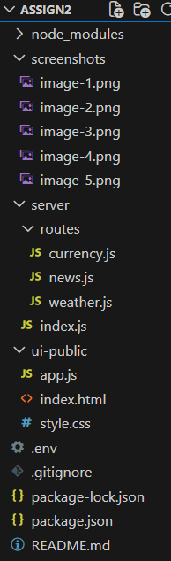

# Assignment 2: API 
### Used APIs
- **OpenWeather API** – real-time weather data
- **News API** – latest news by country
- **Open Exchange Rates API** – currency exchange rates

---

## Project Structure

---

## Setup Instructions
### 1️. Install dependencies
```
npm install
```

### 2️. Create .env file in the root directory
```
OPENWEATHER_API_KEY=your_openweather_api_key
NEWS_API_KEY=your_news_api_key
OPENEXCHANGE_API_KEY=your_open_exchange_rates_key
```

### 3. Run the server
```
node server/index.js
```

The server will run on:
```
http://localhost:3000
```

###  API Endpoints
🌦 Weather API

GET /api/weather?city=Almaty 

Returns:
- city name
- country code
- temperature
- weather description
- coordinates (latitude & longitude)

📰 News API

GET /api/news?country=us

Returns:
- news title
- short description
- source name
- article URL

💱 Currency API

GET /api/currency?currency=KZT

Returns:
- base currency
- requested currency
- exchange rate

### Map Integration
The application uses geographic coordinates from the OpenWeather API to display the selected city on an interactive map using Leaflet.js and OpenStreetMap.

###  User Interface & Responsiveness
The interface is responsive and adapts to different screen sizes using CSS media queries.
All application logic is implemented in JavaScript files (app.js), not inside the HTML file, in accordance with assignment requirements.

###  API Testing with Postman

All backend API endpoints were tested using Postman.

Tested scenarios include:

- Successful requests (200 OK)
- Missing parameters (400 Bad Request)
- Invalid data (404 Not Found)
- External API failure (500 Internal Server Error)

Screenshots of Postman tests are provided in the screenshots folder.

### Postman Screenshots
Weather API – Success (200)

Weather API – Error (400)

News API – Success (200)

Currency API – Success (200)

Server Running


###  Security Considerations
- API keys are stored in environment variables using .env
- API keys are not exposed in frontend code
- All external API calls are handled on the server side

##  Conclusion
This project successfully demonstrates server-side API integration, proper project structure, secure handling of API keys, and effective testing using Postman.
The application meets all the requirements of the assignment and follows best practices in backend development.